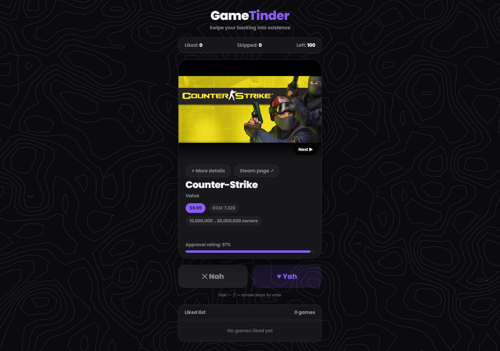
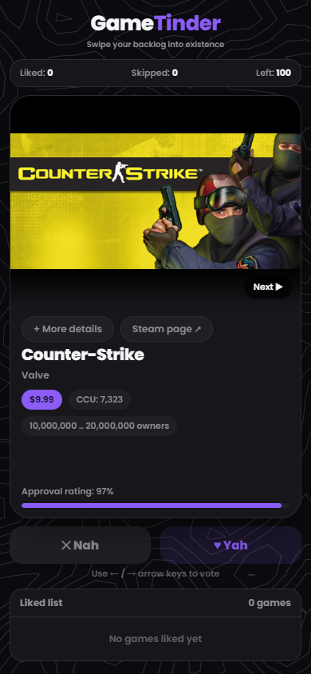

# GameTinder

Swipe your Steam backlog into existence. A Tinder-style card deck for discovering games, backed by SteamSpy and the Steam Store API.



## Features

- **Swipe to decide** — click, tap, or use the arrow keys (`←` skip, `→` like) to vote on a game
- **Endless deck** — pages through SteamSpy so you never run out of games to rate
- **Persistent liked list** — saved to `localStorage`, and liked games never show up again
- **Game details on demand** — expand a card for its real description and genres
- **Screenshot browser** — cycle through a game's actual Steam screenshots
- **One-tap Steam link** — jump straight to the game's store page
- **Animated topographic background** — a moving contour-line canvas rendered from scratch (Perlin noise + marching squares)
- **Mobile-first layout** — portrait card, responsive down to small phone screens

| Details expanded | Mobile |
|---|---|
|  |  |

## Requirements

- Python 3.9+
- pip

## Setup

```bash
git clone https://github.com/AshR3x/GameTinder.git
cd GameTinder
pip install -r requirements.txt
python app.py
```

Then open **http://127.0.0.1:5000** in your browser.

### Access from other devices on your network

The app binds to `0.0.0.0:5000`, so it's reachable from any device on the same LAN:

```
http://<your-computer's-LAN-IP>:5000
```

## How it works

- `app.py` — Flask backend. `/games?page=N` proxies SteamSpy (`top100in2weeks` for page 0, then `request=all` pages after that) so the deck can grow indefinitely. `/game/<appid>` proxies the Steam Store API for description, genres, and screenshots.
- `templates/index.html` — the entire frontend: vanilla JS, no build step, no frameworks.

## Tech stack

- Flask
- SteamSpy API
- Steam Store API
- Vanilla HTML/CSS/JS (Canvas 2D for the background animation)
- Capacitor (Android app wrapper — see `mobile/`)

## Credits

- Android app icon: flame icon from [Flaticon](https://www.flaticon.com/free-icon/fire_16763459), used under Flaticon's free license (attribution required).
